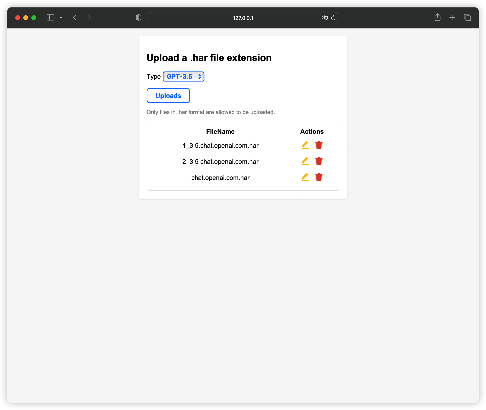

<br>English | [简体中文](README_zh.md)

[](https://github.com/gngpp/ninja/actions/workflows/CI.yml)
[](https://github.com/gngpp/ninja/actions/workflows/Release.yml)
 <a target="_blank" href="https://github.com/gngpp/ninja/blob/main/LICENSE">
  
 </a>
  <a href="https://github.com/gngpp/ninja/releases">
    
  </a><a href="https://github.com/gngpp/ninja/releases">
    
  </a>
  [](https://registry.hub.docker.com/r/gngpp/ninja)
  [](https://hub.docker.com/r/gngpp/ninja/)

# ninja

Reverse engineered `ChatGPT` proxy (bypass Cloudflare 403 Access Denied)

### Features

- API key acquisition
- Email/password account authentication (Google/Microsoft third-party login is temporarily not supported)
- `Unofficial`/`Official`/`ChatGPT-to-API` Http API proxy (for third-party client access)
- Support IP proxy pool
- Minimal memory usage
- ChatGPT WebUI

> Limitations: This cannot bypass OpenAI's outright IP ban

### ArkoseLabs

Sending a `GPT4` conversation requires `Arkose Token` to be sent as a parameter, and there are only three supported solutions for the time being

1) The endpoint obtained by `Arkose Token`, no matter what method you use, use `--arkose-token-endpoint` to specify the endpoint to obtain the token. The supported `JSON` format is generally in accordance with the format of the community: `{"token": "xxxxxx"}`

2) Using HAR, `ChatGPT` official website sends a `GPT4` session message, and the browser `F12` downloads `https://tcr9i.chat.openai.com/fc/gt2/public_key/35536E1E-65B4-4D96-9D97-6ADB7EFF8147` For the HAR log file of the interface, use the startup parameter `--arkose-chat-har-file` to specify the HAR file path to use (if the path is not specified, the default path `~/.chat.openai.com.har` will be used, and updates can be uploaded directly HAR), supports uploading and updating HAR, request path: `/har/upload`, optional upload authentication parameter: `--arkose-har-upload-key`

3) Use [YesCaptcha](https://yescaptcha.com/i/1Cc5i4)/[CapSolver](https://dashboard.capsolver.com/passport/register?inviteCode=y7CtB_a-3X6d) platform for verification code parsing, start the parameter `--arkose-solver` to select the platform (the default is `YesCaptcha`), `--arkose-solver-key` fill in `Client Key`

- All three solutions are used, the priority is: `HAR` > `YesCaptcha/CapSolver` > `Arkose Token endpoint`
- `YesCaptcha/CapSolver` is recommended to be used with HAR. When the verification code is generated, the parser is called for processing. After verification, HAR is more durable.

> Currently OpenAI has updated that login requires verification of `Arkose Token`. The solution is the same as GPT4. Fill in the startup parameters and specify the HAR file `--arkose-auth-har-file`. If you don't want to upload, you can log in through the browser code, which is not required.

### Command Line(dev)

### Http Server

#### Public interface, `*` represents any `URL` suffix

- backend-api, <https://host:port/backend-api/*>
- public-api, <https://host:port/public-api/*>
- platform-api, <https://host:port/v1/*>
- dashboard-api, <https://host:port/dashboard/*>
- chatgpt-to-api, <https://host:port/to/v1/chat/completions>

#### API documentation

- Platfrom API [doc](https://platform.openai.com/docs/api-reference)
- Backend API [doc](doc/rest.http)

> About using `ChatGPT` to `API`, use `AceessToken` directly as `API Key`, interface path: `/to/v1/chat/completions`

#### Basic services

- Authentic ChatGPT WebUI
- Expose `unofficial`/`official API` proxies
- The `API` prefix is consistent with the official
- `ChatGPT` To `API`
- Accessible to third-party clients
- Access to IP proxy pool to improve concurrency
- API documentation

- Parameter Description
  - `--level`, environment variable `LOG`, log level: default info
  - `--host`, environment variable `HOST`, service listening address: default 0.0.0.0,
  - `--port`, environment variable `PORT`, listening port: default 7999
  - `--tls-cert`, environment variable `TLS_CERT`', TLS certificate public key. Supported format: EC/PKCS8/RSA
  - `--tls-key`, environment variable `TLS_KEY`, TLS certificate private key
  - `--proxies`, Proxy, supports proxy pool, multiple proxies are separated by `,`, format: protocol://user:pass@ip:port, if the local IP is banned, you need to turn off the use of direct IP when using the proxy pool, `-- disable-direct` turns off direct connection, otherwise your banned local IP will be used according to load balancing
  - `--workers`, worker threads: default 1
  - `--disable-webui`, if you don’t want to use the default built-in WebUI, use this parameter to turn it off

[...](https://github.com/gngpp/ninja/blob/main/README.md#command-manual)

### Install

- #### Ubuntu(Other Linux)

Making [Releases](https://github.com/gngpp/ninja/releases/latest) has a precompiled deb package, binaries, in Ubuntu, for example:

```shell
wget https://github.com/gngpp/ninja/releases/download/v0.7.0/ninja-0.7.0-x86_64-unknown-linux-musl.deb
dpkg -i ninja-0.7.0-x86_64-unknown-linux-musl.deb
ninja serve run
```

- #### OpenWrt

There are pre-compiled ipk files in GitHub [Releases](https://github.com/gngpp/ninja/releases/latest), which currently provide versions of aarch64/x86_64 and other architectures. After downloading, use opkg to install, and use nanopi r4s as example:

```shell
wget https://github.com/gngpp/ninja/releases/download/v0.7.0/ninja_0.7.0_aarch64_generic.ipk
wget https://github.com/gngpp/ninja/releases/download/v0.7.0/luci-app-ninja_1.1.3-1_all.ipk
wget https://github.com/gngpp/ninja/releases/download/v0.7.0/luci-i18n-ninja-zh-cn_1.1.3-1_all.ipk

opkg install ninja_0.7.0_aarch64_generic.ipk
opkg install luci-app-ninja_1.1.3-1_all.ipk
opkg install luci-i18n-ninja-zh-cn_1.1.3-1_all.ipk
```

- #### Docker

```shell
docker run --rm -it -p 7999:7999 --name=ninja \
  -e WORKERS=1 \
  -e LOG=info \
  gngpp/ninja:latest run
```

- Docker Compose

> `CloudFlare Warp` is not supported in your region (China), please delete it, or if your `VPS` IP can be directly connected to `OpenAI`, you can also delete it

```yaml
version: '3'

services:
  ninja:
    image: ghcr.io/gngpp/ninja:latest
    container_name: ninja
    restart: unless-stopped
    environment:
      - TZ=Asia/Shanghai
      - PROXIES=socks5://warp:10000
      # - CONFIG=/serve.toml
      # - PORT=8080
      # - HOST=0.0.0.0
      # - TLS_CERT=
      # - TLS_KEY=
    # volumes:
      # - ${PWD}/ssl:/etc
      # - ${PWD}/serve.toml:/serve.toml
    command: run
    ports:
      - "8080:7999"
    depends_on:
      - warp

  warp:
    container_name: warp
    image: ghcr.io/gngpp/warp:latest
    restart: unless-stopped

  watchtower:
    container_name: watchtower
    image: containrrr/watchtower
    volumes:
      - /var/run/docker.sock:/var/run/docker.sock
    command: --interval 3600 --cleanup
    restart: unless-stopped

```

### Command Manual

```shell
$ ninja --help
$ ninja --help
Reverse engineered ChatGPT proxy

Usage: ninja [COMMAND]

Commands:
  run      Run the HTTP server
  stop     Stop the HTTP server daemon
  start    Start the HTTP server daemon
  restart  Restart the HTTP server daemon
  status   Status of the Http server daemon process
  log      Show the Http server daemon log
  gt       Generate config template file (toml format file)
  help     Print this message or the help of the given subcommand(s)

Options:
  -h, --help     Print help
  -V, --version  Print version

$ ninja run --help
Run the HTTP server

Usage: ninja run [OPTIONS]

Options:
  -L, --level <LEVEL>
          Log level (info/debug/warn/trace/error) [env: LOG=] [default: info]
  -C, --config <CONFIG>
          Configuration file path (toml format file) [env: CONFIG=]
  -H, --host <HOST>
          Server Listen host [env: HOST=] [default: 0.0.0.0]
  -P, --port <PORT>
          Server Listen port [env: PORT=] [default: 7999]
  -W, --workers <WORKERS>
          Server worker-pool size (Recommended number of CPU cores) [default: 1]
      --concurrent-limit <CONCURRENT_LIMIT>
          Enforces a limit on the concurrent number of requests the underlying [default: 65535]
  -x, --proxies <PROXIES>
          Server proxies pool, Example: protocol://user:pass@ip:port [env: PROXIES=]
  -i, --interface <INTERFACE>
          Bind address for outgoing connections (or IPv6 subnet fallback to Ipv4) [env: INTERFACE=]
  -I, --ipv6-subnet <IPV6_SUBNET>
          IPv6 subnet, Example: 2001:19f0:6001:48e4::/64 [env: IPV4_SUBNET=]
      --disable-direct
          Disable direct connection [env: DISABLE_DIRECT=]
      --cookie-store
          Enabled Cookie Store [env: COOKIE_STORE=]
      --timeout <TIMEOUT>
          Client timeout (seconds) [default: 600]
      --connect-timeout <CONNECT_TIMEOUT>
          Client connect timeout (seconds) [default: 60]
      --tcp-keepalive <TCP_KEEPALIVE>
          TCP keepalive (seconds) [default: 60]
      --pool-idle-timeout <POOL_IDLE_TIMEOUT>
          Set an optional timeout for idle sockets being kept-alive [default: 90]
      --tls-cert <TLS_CERT>
          TLS certificate file path [env: TLS_CERT=]
      --tls-key <TLS_KEY>
          TLS private key file path (EC/PKCS8/RSA) [env: TLS_KEY=]
      --api-prefix <API_PREFIX>
          WebUI api prefix [env: API_PREFIX=]
      --preauth-api <PREAUTH_API>
          PreAuth Cookie API URL [env: PREAUTH_API=] [default: https://ai.fakeopen.com/auth/preauth]
  -D, --disable-webui
          Disable WebUI [env: DISABLE_WEBUI=]
      --cf-site-key <CF_SITE_KEY>
          Cloudflare turnstile captcha site key [env: CF_SECRET_KEY=]
      --cf-secret-key <CF_SECRET_KEY>
          Cloudflare turnstile captcha secret key [env: CF_SITE_KEY=]
      --arkose-endpoint <ARKOSE_ENDPOINT>
          Arkose endpoint, Example: https://client-api.arkoselabs.com
  -A, --arkose-token-endpoint <ARKOSE_TOKEN_ENDPOINT>
          Get arkose token endpoint
      --arkose-chat-har-file <ARKOSE_CHAT_HAR_FILE>
          About the browser HAR file path requested by ChatGPT ArkoseLabs
      --arkose-auth-har-file <ARKOSE_AUTH_HAR_FILE>
          About the browser HAR file path requested by Auth ArkoseLabs
      --arkose-platform-har-file <ARKOSE_PLATFORM_HAR_FILE>
          About the browser HAR file path requested by Platform ArkoseLabs
  -K, --arkose-har-upload-key <ARKOSE_HAR_UPLOAD_KEY>
          HAR file upload authenticate key
  -s, --arkose-solver <ARKOSE_SOLVER>
          About ArkoseLabs solver platform [default: yescaptcha]
  -k, --arkose-solver-key <ARKOSE_SOLVER_KEY>
          About the solver client key by ArkoseLabs
  -T, --tb-enable
          Enable token bucket flow limitation
      --tb-store-strategy <TB_STORE_STRATEGY>
          Token bucket store strategy (mem/redis) [default: mem]
      --tb-redis-url <TB_REDIS_URL>
          Token bucket redis connection url [default: redis://127.0.0.1:6379]
      --tb-capacity <TB_CAPACITY>
          Token bucket capacity [default: 60]
      --tb-fill-rate <TB_FILL_RATE>
          Token bucket fill rate [default: 1]
      --tb-expired <TB_EXPIRED>
          Token bucket expired (seconds) [default: 86400]
  -h, --help
          Print help
```

### Platform Support

- Linux
  - `x86_64-unknown-linux-musl`
  - `aarch64-unknown-linux-musl`
  - `armv7-unknown-linux-musleabi`
  - `armv7-unknown-linux-musleabihf`
  - `arm-unknown-linux-musleabi`
  - `arm-unknown-linux-musleabihf`
  - `armv5te-unknown-linux-musleabi`
- Windows
  - `x86_64-pc-windows-msvc`
- MacOS
  - `x86_64-apple-darwin`
  - `aarch64-apple-darwin`

### Compile

- Linux compile, Ubuntu machine for example:

```shell
git clone https://github.com/gngpp/ninja.git && cd ninja
cargo build --release
```

- OpenWrt Compile

```shell
cd package
svn co https://github.com/gngpp/ninja/trunk/openwrt
cd -
make menuconfig # choose LUCI->Applications->luci-app-ninja  
make V=s
```

### Instructions

- Open source projects can be modified, but please keep the original author information to avoid losing technical support.
- Project is standing on the shoulders of other giants, thanks!
- Submit an issue if there are errors, bugs, etc., and I will fix them.

### Preview



